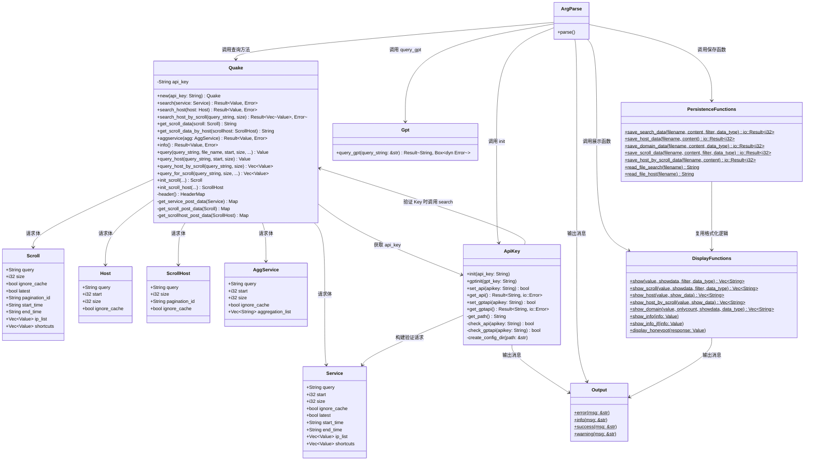
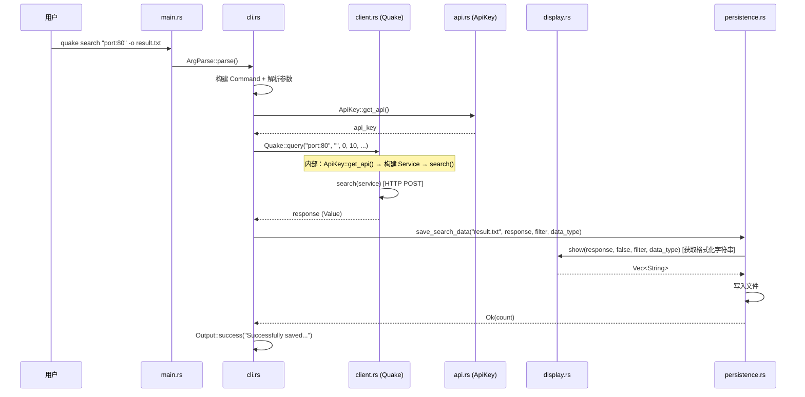
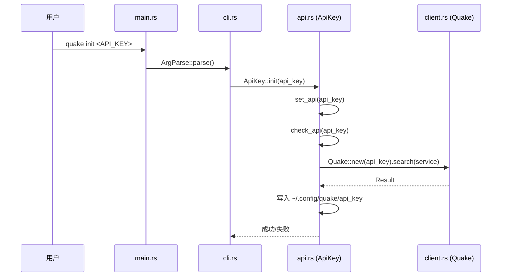
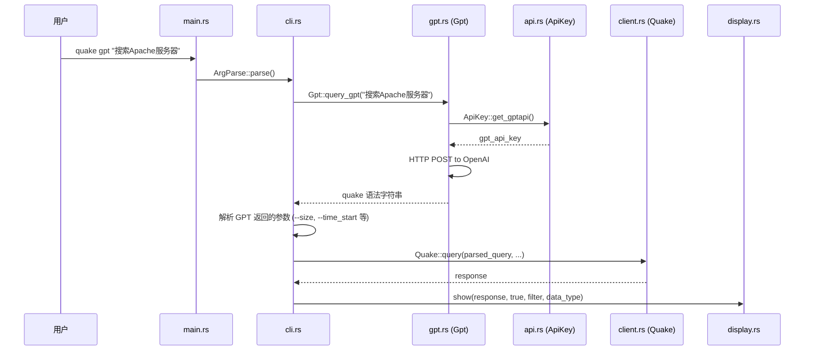
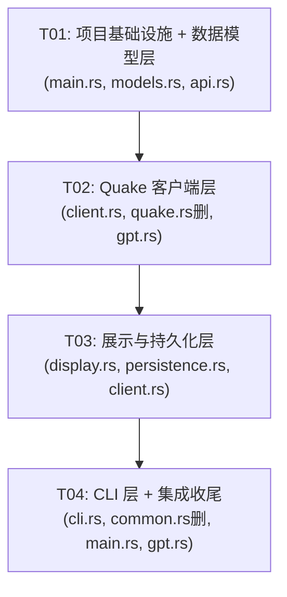

# quake_rs 代码结构解耦方案

## Part A: 系统设计

### 1. 实现方案分析

#### 核心技术挑战

1. **God File 拆分**：`common.rs`（903 行）和 `quake.rs`（1289 行）职责混乱，需按功能维度拆分
2. **`pub mod quake {}` 嵌套消除**：当前 `quake.rs` 内部用 `pub mod quake {}` 包裹，导致引用路径为 `crate::quake::quake::Quake`，需简化
3. **循环模块依赖**：`api.rs` ↔ `quake.rs` 存在循环引用（`api.rs` 调用 `Quake::getdate()` 和 `Quake::new().search()` 验证 Key，`quake.rs` 调用 `ApiKey::get_api()` 获取 Key）。Rust 同 crate 内模块循环引用可编译，但设计上应尽量降低耦合
4. **展示逻辑与数据获取耦合**：`show_info()`/`show_info_jf()`/`honeypot()` 方法同时包含 API 调用和展示逻辑
5. **save_* 方法复用 show_* 方法**：`persistence.rs` 依赖 `display.rs` 的格式化能力，需保留此调用链

#### 框架和库选择

保持现有依赖不变，不引入新第三方库。核心依赖：
- `clap@^4.6`：CLI 定义（继续使用 builder 模式，保持与现有代码一致）
- `reqwest@^0.13`：HTTP 客户端
- `serde`/`serde_json`：序列化
- `ansi_term@^0.12.1`：终端彩色输出
- `chrono@^0.4`：日期处理

#### 架构模式

采用**分层架构**，自底向上：

```
┌─────────────────────────────────┐
│         cli.rs (入口层)          │  CLI 定义 + 子命令分发
├─────────────────────────────────┤
│  display.rs  │  persistence.rs  │  展示层 + 持久化层
├─────────────────────────────────┤
│         client.rs (服务层)       │  HTTP API 客户端 + 查询编排
├─────────────────────────────────┤
│  api.rs  │  gpt.rs  │ models.rs │  基础设施层
└─────────────────────────────────┘
```

### 2. 文件列表

```
src/
├── main.rs          # 入口点，模块声明
├── models.rs        # 数据结构 + 输出工具 + 工具函数
├── client.rs        # Quake HTTP API 客户端（替代 quake.rs）
├── display.rs       # 数据展示/格式化逻辑
├── persistence.rs   # 文件 I/O（保存/读取）
├── cli.rs           # CLI 定义 + 子命令分发（替代 common.rs）
├── api.rs           # API Key 管理（保留，调整导入）
├── gpt.rs           # GPT API 客户端（保留，调整导入）
```

**删除的文件**：
- `common.rs` → 内容分散到 `models.rs`、`cli.rs`
- `quake.rs` → 内容分散到 `client.rs`、`display.rs`、`persistence.rs`

### 3. 数据结构和接口



### 4. 程序调用流程

#### 4.1 搜索流程（search 子命令）



#### 4.2 初始化流程（init 子命令）



#### 4.3 GPT 智能搜索流程



### 5. 不明确之处

1. **`show_info()`/`show_info_jf()` 的归属**：这两个方法当前同时包含 API 调用和数据展示。方案中将它们拆分为 `Quake::info()`（数据获取）和 `display::show_info(info: Value)`（纯展示），由 `cli.rs` 编排调用。这改变了内部调用链，但外部行为不变。
2. **`honeypot()` 的归属**：同上，拆分为 `Quake.aggservice()` + `display::display_honeypot()`，由 `cli.rs` 编排。
3. **`client.rs` ↔ `api.rs` 循环依赖**：`client.rs` 调用 `ApiKey::get_api()`，`api.rs` 调用 `Quake::new().search()` 验证 Key。在 Rust 同 crate 内可编译，但设计上不够理想。本方案保持此循环依赖不变（与现有行为一致），可通过后续将 Key 验证逻辑独立来消除。
4. **`query()`/`query_host()` 等高级方法**：这些方法内部调用 `ApiKey::get_api()` 获取密钥再调用实例方法。方案中保留在 `client.rs`，作为 `Quake` 的关联函数。若需更彻底的解耦，可将其移至 `cli.rs` 作为编排逻辑。
5. **`clap` 使用方式**：Cargo.toml 启用了 `derive` feature，但当前代码使用 builder 模式。本方案保持 builder 模式不变，避免大规模重写。

---

## Part B: 任务分解

### 6. 所需包

```
# 现有依赖，无需变更
reqwest@^0.13: HTTP 客户端（blocking + json features）
serde@^1.0.219: 序列化框架（derive feature）
serde_json@^1.0.140: JSON 处理
clap@^4.6: CLI 框架（derive feature）
dirs@^6.0.0: 获取用户主目录
log@^0.4.27: 日志门面
env_logger@^0.11.6: 日志实现
ansi_term@^0.12.1: 终端彩色输出
chrono@^0.4.41: 日期时间处理
regex@^1.12.3: 正则表达式
ipaddress@^0.1.1: IP 地址验证
```

### 7. 任务列表

#### T01: 项目基础设施 + 数据模型层

- **源文件**: `main.rs`, `models.rs`, `api.rs`
- **依赖**: 无
- **优先级**: P0
- **内容**:
  1. 更新 `main.rs` 模块声明：`mod models; mod client; mod display; mod persistence; mod cli;`（暂时保留 `mod common; mod quake;` 直到迁移完成）
  2. 创建 `models.rs`：
     - 从 `common.rs` 提取 5 个数据结构体：`Service`, `Scroll`, `Host`, `ScrollHost`, `AggService`
     - 从 `common.rs` 提取 `Output` 结构体及其 4 个方法
     - 从 `quake.rs` 提取工具函数：`getdate()`, `getdate_for_manual()`（改为 `pub` 自由函数）
  3. 更新 `api.rs` 导入路径：
     - `crate::common::{Output, Service}` → `crate::models::{Output, Service}`
     - `crate::quake::quake::Quake` → `crate::client::Quake`
     - `Quake::getdate()` → `crate::models::getdate()`

#### T02: Quake 客户端层

- **源文件**: `client.rs`, `quake.rs`（删除）, `gpt.rs`
- **依赖**: T01
- **优先级**: P0
- **内容**:
  1. 创建 `client.rs`：
     - 从 `quake.rs` 迁移 `Quake` 结构体及其所有 `impl` 方法
     - **消除 `pub mod quake {}` 嵌套**，使 `Quake` 直接位于 `client` 模块顶层
     - 引用路径从 `crate::quake::quake::Quake` 简化为 `crate::client::Quake`
     - 更新内部导入：`crate::common::*` → `crate::models::*`
     - 保留所有 HTTP 请求方法、高级查询方法、初始化方法、内部辅助方法
     - 暂时保留 `show_*`/`save_*`/`read_file_*` 方法（T03 迁移）
  2. 删除 `quake.rs` 文件
  3. 更新 `gpt.rs` 导入路径（如有引用 Quake 的地方）

#### T03: 展示与持久化层

- **源文件**: `display.rs`, `persistence.rs`, `client.rs`
- **依赖**: T02
- **优先级**: P0
- **内容**:
  1. 创建 `display.rs`：
     - 从 `client.rs` 提取展示方法为独立函数：
       - `show(value, showdata, filter, data_type)` → `pub fn show(...)`
       - `show_scroll(...)` → `pub fn show_scroll(...)`
       - `show_host(...)` → `pub fn show_host(...)`
       - `show_host_by_scroll(...)` → `pub fn show_host_by_scroll(...)`
       - `show_domain(...)` → `pub fn show_domain(...)`
     - 拆分 `show_info()` 为纯展示函数 `pub fn show_info(info: Value)`（不再内部调用 API）
     - 拆分 `show_info_jf()` 为纯展示函数 `pub fn show_info_jf(info: Value)`
     - 拆分 `honeypot()` 展示逻辑为 `pub fn display_honeypot(response: Value)`
  2. 创建 `persistence.rs`：
     - 从 `client.rs` 提取保存方法为独立函数：
       - `save_search_data(...)` → `pub fn save_search_data(...)`
       - `save_host_data(...)` → `pub fn save_host_data(...)`
       - `save_domain_data(...)` → `pub fn save_domain_data(...)`
       - `save_scroll_data(...)` → `pub fn save_scroll_data(...)`
       - `save_host_by_scroll_data(...)` → `pub fn save_host_by_scroll_data(...)`
     - 从 `client.rs` 提取文件读取方法：
       - `read_file_search(...)` → `pub fn read_file_search(...)`
       - `read_file_host(...)` → `pub fn read_file_host(...)`
     - `save_*` 方法中对 `show_*` 的调用改为 `crate::display::*`
  3. 更新 `client.rs`：
     - 移除已迁移到 `display.rs` 和 `persistence.rs` 的方法
     - `query()`/`query_host()` 等高级方法中对 `read_file_*` 的调用改为 `crate::persistence::*`

#### T04: CLI 层 + 集成收尾

- **源文件**: `cli.rs`, `common.rs`（删除）, `main.rs`, `gpt.rs`
- **依赖**: T03
- **优先级**: P0
- **内容**:
  1. 创建 `cli.rs`：
     - 从 `common.rs` 迁移 `ArgParse` 结构体及 `parse()` 方法
     - 更新 `parse()` 中的调用：
       - `Quake::show*()` → `display::show*()`
       - `Quake::save_*()` → `persistence::save_*()`
       - `Quake::read_file_*()` → `persistence::read_file_*()`
       - `Quake::show_info()` → 获取数据后调用 `display::show_info()`
       - `Quake::show_info_jf()` → 获取数据后调用 `display::show_info_jf()`
       - `Quake::honeypot()` → 调用 `Quake` 获取数据 + `display::display_honeypot()`
     - 更新所有导入路径
  2. 删除 `common.rs`
  3. 更新 `main.rs` 为最终形式：
     - 移除 `mod common; mod quake;`
     - 保留 `mod models; mod client; mod display; mod persistence; mod cli; mod api; mod gpt;`
     - `common::ArgParse::parse()` → `cli::ArgParse::parse()`
  4. 更新 `gpt.rs` 导入路径（确保无残留旧路径）

### 8. 共享知识

```
- 模块引用规则：所有 crate 内引用使用 crate:: 路径，如 crate::models::Output
- Quake 结构体引用路径：crate::client::Quake（替代旧的 crate::quake::quake::Quake）
- 数据结构引用路径：crate::models::{Service, Scroll, Host, ScrollHost, AggService}
- 展示函数引用路径：crate::display::{show, show_scroll, show_host, ...}
- 持久化函数引用路径：crate::persistence::{save_search_data, read_file_search, ...}
- 工具函数引用路径：crate::models::{getdate, getdate_for_manual}
- Output 引用路径：crate::models::Output
- display.rs 中所有函数为独立自由函数（pub fn），不再是 Quake 的关联函数
- persistence.rs 中所有函数为独立自由函数（pub fn）
- show_info/show_info_jf 改为纯展示函数，参数为已获取的 Value 数据
- honeypot 展示逻辑分离到 display::display_honeypot()，数据获取留在 client.rs
- 保持功能语义不变：所有子命令的输入输出行为与重构前完全一致
- Rust edition 2018：模块声明在 main.rs，子模块文件与 main.rs 同级
```

### 9. 任务依赖图



---

## 附录：各文件详细内容概要

### main.rs（最终形式）

```rust
mod api;
mod cli;
mod client;
mod display;
mod gpt;
mod models;
mod persistence;

fn main() {
    env_logger::init();
    cli::ArgParse::parse();
}
```

### models.rs

| 类型 | 名称 | 说明 |
|------|------|------|
| struct | `Service` | 服务查询请求体（derive Serialize/Deserialize/Debug） |
| struct | `Scroll` | Scroll 分页查询请求体 |
| struct | `Host` | Host 查询请求体 |
| struct | `ScrollHost` | Host Scroll 分页查询请求体 |
| struct | `AggService` | 聚合查询请求体 |
| struct | `Output` | 终端输出工具（error/info/success/warning） |
| fn | `getdate() -> (String, String)` | 获取当前时间和一年前时间 |
| fn | `getdate_for_manual(manual_date: &str) -> String` | 获取指定日期一年前的日期 |

### client.rs

| 类型 | 名称 | 说明 |
|------|------|------|
| const | `BASE_URL` | API 基础 URL |
| struct | `Quake` | HTTP API 客户端（含 api_key 字段） |
| method | `new(api_key)` | 构造函数 |
| method | `search(&self, service)` | POST /api/v3/search/quake_service |
| method | `search_host(&self, host)` | POST /api/v3/search/quake_host |
| method | `search_host_by_scroll(&self, query, size)` | Scroll 方式查询 Host |
| method | `get_scroll_data(&self, scroll)` | POST /api/v3/scroll/quake_service |
| method | `get_scroll_data_by_host(&self, scrollhost)` | POST /api/v3/scroll/quake_host |
| method | `aggservice(&self, agg)` | POST /api/v3/aggregation/quake_service |
| method | `info(&self)` | GET /api/v3/user/info |
| assoc fn | `query(...)` | 高级查询：获取 Key → 构建 Service → search |
| assoc fn | `query_host(...)` | 高级 Host 查询 |
| assoc fn | `query_host_by_scroll(...)` | 高级 Host Scroll 查询 |
| assoc fn | `query_for_scroll(...)` | 高级 Scroll 查询 |
| assoc fn | `init_scroll(...)` | 构建 Scroll 结构体 |
| assoc fn | `init_scroll_host(...)` | 构建 ScrollHost 结构体 |
| private method | `header(&self)` | 构建认证请求头 |
| private fn | `get_service_post_data(Service)` | Service → JSON Map |
| private fn | `get_scroll_post_data(Scroll)` | Scroll → JSON Map |
| private fn | `get_scrollhost_post_data(ScrollHost)` | ScrollHost → JSON Map |

### display.rs

| 类型 | 名称 | 说明 |
|------|------|------|
| fn | `show(value, showdata, filter, data_type) -> Vec<String>` | 格式化展示搜索结果 |
| fn | `show_scroll(value, showdata, filter, data_type) -> Vec<String>` | 格式化展示 Scroll 结果 |
| fn | `show_host(value, show_data) -> Vec<String>` | 格式化展示 Host 结果 |
| fn | `show_host_by_scroll(value, show_data) -> Vec<String>` | 格式化展示 Host Scroll 结果 |
| fn | `show_domain(value, onlycount, showdata, data_type) -> Vec<String>` | 格式化展示域名结果 |
| fn | `show_info(info: Value)` | 展示用户完整信息（纯展示，不调用 API） |
| fn | `show_info_jf(info: Value)` | 展示用户积分信息（纯展示，不调用 API） |
| fn | `display_honeypot(response: Value)` | 展示蜜罐检测结果（纯展示） |

### persistence.rs

| 类型 | 名称 | 说明 |
|------|------|------|
| fn | `save_search_data(filename, content, filter, data_type) -> io::Result<i32>` | 保存搜索结果到文件 |
| fn | `save_host_data(filename, content) -> io::Result<i32>` | 保存 Host 结果到文件 |
| fn | `save_domain_data(filename, content, data_type) -> io::Result<i32>` | 保存域名结果到文件 |
| fn | `save_scroll_data(filename, content, filter, data_type) -> io::Result<i32>` | 保存 Scroll 结果到文件 |
| fn | `save_host_by_scroll_data(filename, content) -> io::Result<i32>` | 保存 Host Scroll 结果到文件 |
| fn | `read_file_search(filename) -> String` | 读取搜索查询文件 |
| fn | `read_file_host(filename) -> String` | 读取 Host 查询文件 |

### cli.rs

| 类型 | 名称 | 说明 |
|------|------|------|
| struct | `ArgParse` | CLI 解析器 |
| method | `parse()` | 定义 CLI 命令 + 解析参数 + 分发到业务逻辑 |

### api.rs（调整后）

| 变更 | 说明 |
|------|------|
| 导入变更 | `crate::common::{Output, Service}` → `crate::models::{Output, Service}` |
| 导入变更 | `crate::quake::quake::Quake` → `crate::client::Quake` |
| 调用变更 | `Quake::getdate()` → `crate::models::getdate()` |
| 其他 | 逻辑不变 |

### gpt.rs（调整后）

| 变更 | 说明 |
|------|------|
| 导入变更 | `crate::api::ApiKey` 保持不变 |
| 其他 | 逻辑不变 |

## 模块依赖关系图

```
main.rs
  └── cli.rs
        ├── client.rs
        │     ├── api.rs (ApiKey::get_api)
        │     └── models.rs (Service, Scroll, Host, etc.)
        ├── display.rs
        │     └── models.rs (Output)
        ├── persistence.rs
        │     ├── display.rs (show* 用于格式化)
        │     └── models.rs (Output)
        ├── api.rs (ApiKey::init, ApiKey::gptinit)
        ├── gpt.rs (Gpt::query_gpt)
        └── models.rs (Output)

api.rs
  ├── client.rs (Quake::new().search 用于验证)
  └── models.rs (Output, Service, getdate)

gpt.rs
  └── api.rs (ApiKey::get_gptapi)
```

## 新旧文件映射

| 原文件 | 原内容 | 新文件 | 新位置 |
|--------|--------|--------|--------|
| common.rs | Service/Scroll/Host/ScrollHost/AggService | models.rs | 数据结构 |
| common.rs | Output | models.rs | 输出工具 |
| common.rs | ArgParse (CLI 定义 + 分发) | cli.rs | CLI 层 |
| quake.rs | `pub mod quake {}` 嵌套 | （消除） | 不再需要 |
| quake.rs | Quake 结构体 + HTTP 方法 | client.rs | 客户端层 |
| quake.rs | show*/show_info/show_info_jf/honeypot 展示 | display.rs | 展示层 |
| quake.rs | save_*/read_file_* | persistence.rs | 持久化层 |
| quake.rs | getdate/getdate_for_manual | models.rs | 工具函数 |
| api.rs | ApiKey 管理 | api.rs | 保留，调整导入 |
| gpt.rs | Gpt 客户端 | gpt.rs | 保留，调整导入 |
| main.rs | 入口 | main.rs | 更新模块声明 |
